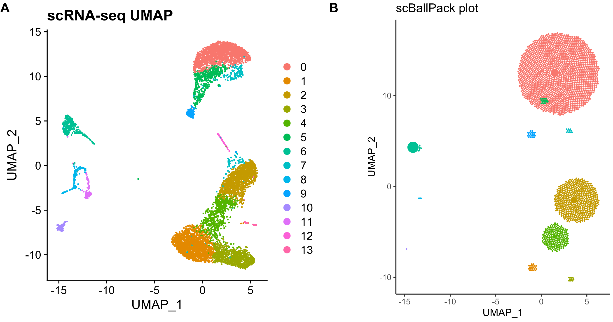

# scballpack
[]
[]

```scballpack``` is a work-in-progress R package to produce "ball-packing" visualizations of the clonal expansion of T-cells in a seurat(V4) object, based on its T-cell-receptor (TCR) library generated from a cellranger output of 10X single-cell immune profiling. 

The concept was first implemented in a study by Ma et al.[[1]](#1) for nasal polyp $T_{H}$ cells. The resulting plot visually quantified clonal expansion, as seen in the following figure. 



## Installation
The package and its build is incomplete at the moment. However, if this repository is cloned, one could manually run all the scripts in ```/R```

All dependencies in the DESCRIPTION file should also be installed and loaded. 

## Usage
The main function in the package takes two main arguments: 
- a seurat object with a UMAP reduction
- a TCR library dataframe, from ```all_contig_annotations.csv``` generated by Cell Ranger 3.0.0.

And integrates the TCR library into the seurat object metadata(creates a new temporary seurat object). It then will produce a *ggplot* of clusters of circles at roughly the same UMAP coordinates, where the circle size represents the clone size. An example to do so is shown below.

```R
library(Seurat)
library(readr)
#library(scballpack)

# run sc-RNAseq pipeline to produce a seurat_object

seurat_object <- RunUMAP(seurat_object)
TCR_dataframe <- read.csv("file_location/all_contig_annotations.csv")

# produce and show the ball-packing plot
ball_pack_plot <- scballpack(seurat_object, TCR_dataframe)
ball_pack_plot
```

## Contributing
The package is currently incomplete, and more features, tests, bugfixes, and documentation are to come. However, pull requests from forked branches are more than welcome as it is mostly a solo-project at the moment. For major changes, please open an issue first to discuss what you would like to change. Please also make sure to update tests as appropriate.

An explanation of the algorithms will eventually be made publicly available in a either a pre-print or developer vignette, in addition to publication to CRAN.

## Contact
Qile Yang - qile0317@gmail.com

## References
<a id="1">[1]</a> 
Ma, J., Tibbitt, C. A., Georén, S. K., Christian, M., Murrell, B., Cardell, L. O., Bachert, C., & Coquet, J. M. (2021). Single-cell analysis pinpoints distinct populations of cytotoxic CD4+ T cells and an IL-10+CD109+ TH2 cell population in nasal polyps. Science immunology, 6(62), eabg6356. https://doi.org/10.1126/sciimmunol.abg6356

## Acknowledgements
Thanks to Ben Murrel (@murrelb) at the Karolinska Instituet for introducing the idea, giving suggestions, and building the ```julia``` implementation of the ball packing algorithm in the original paper.