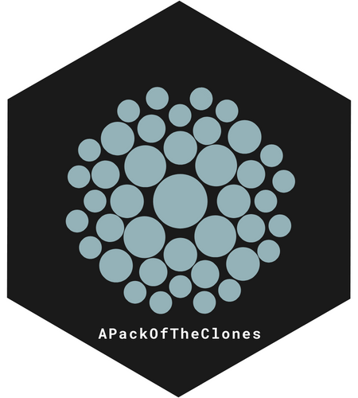
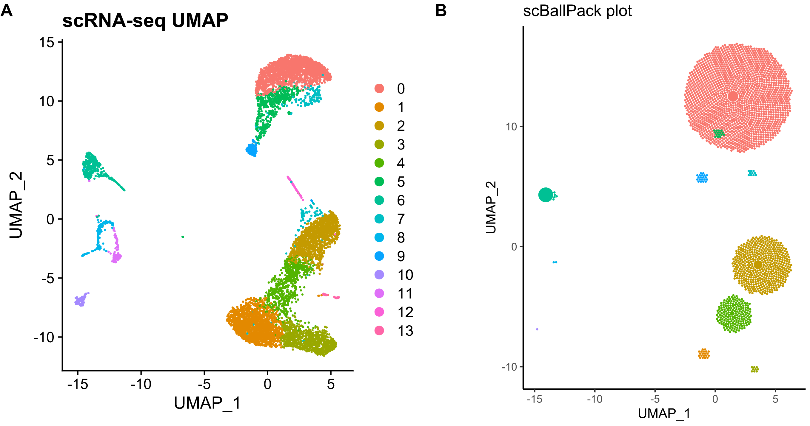

# APackOfTheClones 

<!-- badges: start -->
[](https://CRAN.R-project.org/package=APackOfTheClones)
[](https://www.r-pkg.org/pkg/APackOfTheClones)
[](https://CRAN.R-project.org/package=APackOfTheClones)
[](https://github.com/Qile0317/APackOfTheClones/actions/workflows/R-CMD-check.yaml)
[](https://app.codecov.io/gh/Qile0317/APackOfTheClones?branch=main)
[](https://qile0317.github.io/APackOfTheClones/)
[](https://lifecycle.r-lib.org/articles/stages.html#experimental)

<!-- badges: end -->

```APackOfTheClones``` is an R package that extends the bioconductor ```scRepertoire``` package to produce easily customizable "ball-packing" visualizations of the clonal expansion of T-cells in a `Seurat` object, based on its T-cell-receptor (TCR) library generated from the Cell Ranger output of 10X single-cell immune profiling.

The baseline concept was first implemented in a study Ma et al.[[1]](#1) by Murray Christian and Ben Murrell (@Murrellb) for nasal polyp $T_{H}$ cells. `APackOfTheClones` counts the clonotype frequencies for each seurat/umap cluster and produces a circle packing of the frequencies to intuitively represent clonal expansion. The packing for each cluster are then plotted with roughly the same coordinates as the original dimensional reduction and color. Below is an example of `APackOfTheClones` being used on a [public 10X genomics dataset](https://www.10xgenomics.com/resources/datasets/pbm-cs-from-bal-bc-mice-tcr-enrichment-from-amplified-c-dna-1-standard-3-0-0):



## Installation

`APackOfTheClones` is registered on CRAN. To install the latest stable release, simply run the following

```R
install.packages("APackOfTheClones")
```

Alternatively, to download the latest semi-stable development edition on the development (`dev`) branch, run

```R
library(devtools)
devtools::install_github("Qile0317/APackOfTheClones@dev")
```

## Usage

The package extends the functionality of `scRepertoire` ***v2*** by working with a seurat object's corresponding T/B cell receptor library. To do this, read the [scRepertoire vignette](borch.dev/uploads/screpertoire). Briefly, an scTCR-seq/scBCR-seq experiment (e.g. from a 10X genomics single cell immune profiling run) should be processed with ```scRepertoire::combineTCR``` / ```scRepertoire::combineBCR``` first. Then, it should be integrated into the corresponding seurat object either with ```combineSeuratExpression```, which is a wrapper for ```scRepertoire::combineExpression```.

To quickly produce the visualization, the ```vizAPOTC(your_seurat_object)``` should give a reasonable visualization. There is an example seurat object included in the package which can be used with ```data("combined_pbmc")```. The following codechunk is an example of how it can be done:

```R
library(Seurat)
library(scRepertoire)
library(APackOfTheClones)

# integrate the contigs with scRepertoire example data - this is identical to "combined_pbmc"
pbmc <- combineSeuratExpression(
    input.data = scRepertoire::combineTCR(
        input.data = get(data("mini_contig_list")),
        samples = c("P17B", "P17L", "P18B", "P18L", "P19B", "P19L", "P20B", "P20L")
    ),
    sc.data = get(data("scRep_example"))
)

# produce the ball-packing plot
vizAPOTC(pbmc)

# there are many parameters to adjust, but most importantly, one can filter for
# subsets of the seurat object easily with keyword arguments corresponding to
# columns in the meta.data dataframe in the seurat object. Here, we filter for
# only the clones of the sample "P17" in a column named "orig.ident" that are only
# in seurat clusters 1, 3, and 4.
vizAPOTC(pbmc, orig.ident = c("P17B", "P17L"), seurat_clusters = c(1, 3, 4))
```

For finer control of the visualization / other parameters, the data for a run can be stored and adjusted with ```RunAPOTC``` and ```AdjustAPOTC```, then visualized with ```APOTCPlot```. (TODO)

## Documentation
Comprehensive documentation, vignettes, and a changelog is deployed at https://qile0317.github.io/APackOfTheClones/

All exported functions has function level documentation which can be called with `?function`.

Currently, there is only one introductory vignette named `"Clonal_expansion_plotting"` which is a walkthrough on the clonal expansion visualization workflow. The vignette is ONLINE-ONLY and can be viewed at https://qile0317.github.io/APackOfTheClones/articles/

## Contributing
Github pull requests from forked branches are more than welcome as it is mostly a solo-project at the moment. For major changes, please open an issue first to discuss what you would like to change. Please also make sure to update tests as appropriate.

An explanation of the algorithms will eventually be made publicly available in a either a pre-print or developer vignette.

## Upcoming features

One novel feature in the making is the ability to visualize shared clonotypes on the ball packing plot

## Contact
Qile Yang - qile.yang@berkeley.edu

## References
<a id="1">[1]</a> 
Ma, J., Tibbitt, C. A., Georén, S. K., Christian, M., Murrell, B., Cardell, L. O., Bachert, C., & Coquet, J. M. (2021). Single-cell analysis pinpoints distinct populations of cytotoxic CD4+ T cells and an IL-10+CD109+ TH2 cell population in nasal polyps. Science immunology, 6(62), eabg6356. https://doi.org/10.1126/sciimmunol.abg6356

<a id="2">[2]</a> 
atakanekiz (2019) Tutorial:Integrating VDJ sequencing data with Seurat. https://www.biostars.org/p/384640/

## Acknowledgements
Thanks for Ben Murrell (@murrelb) at the Karolinska Institute for introducing the idea, implementing julia code, debug support, and giving suggestions. Thanks to Nick Borcherding (@ncborcherding) for providing more insights,  suggestions, and promoting the package.
